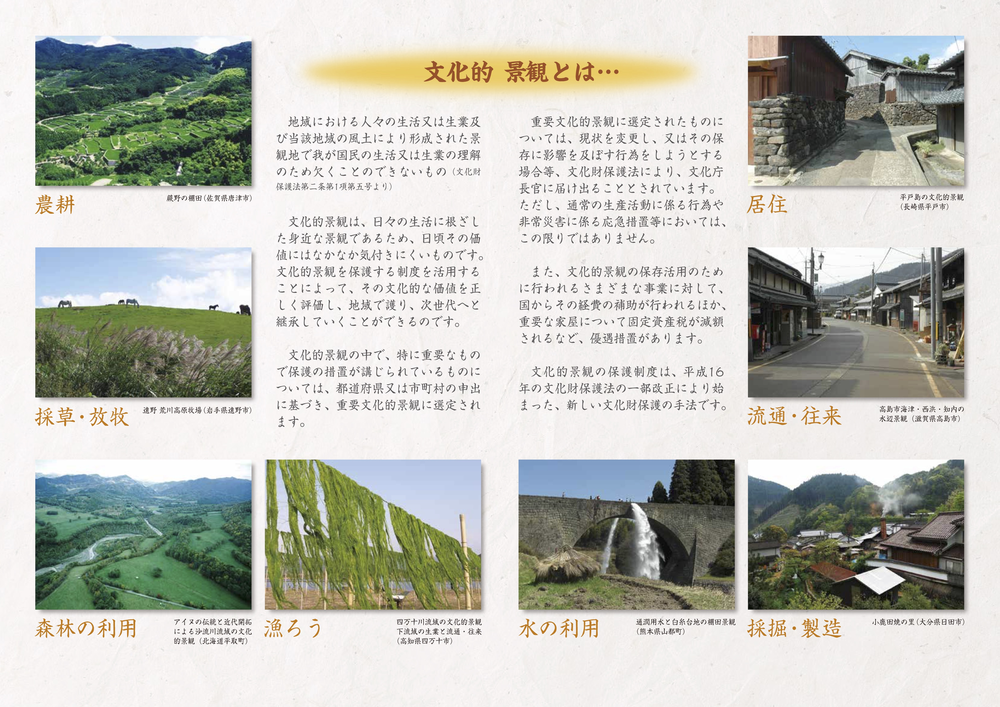
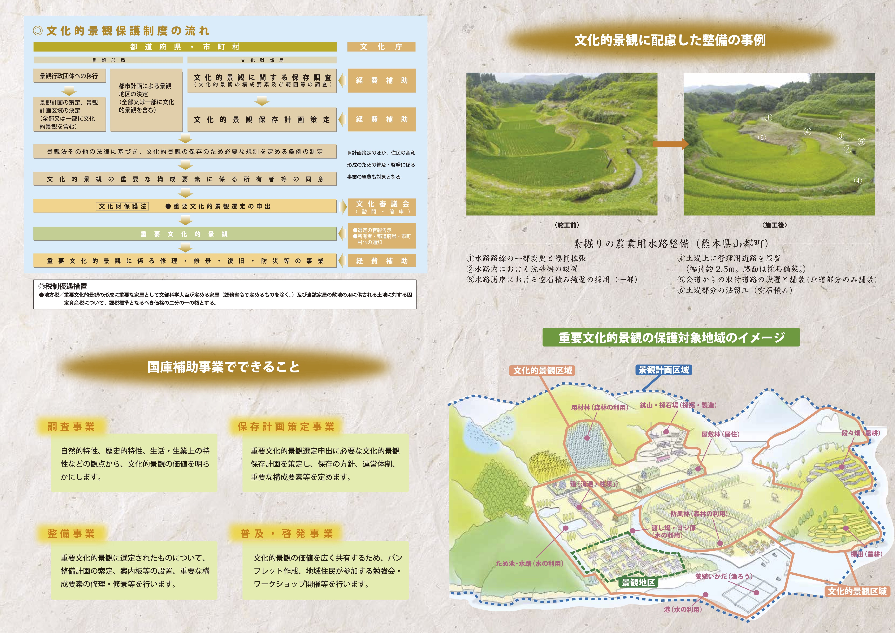
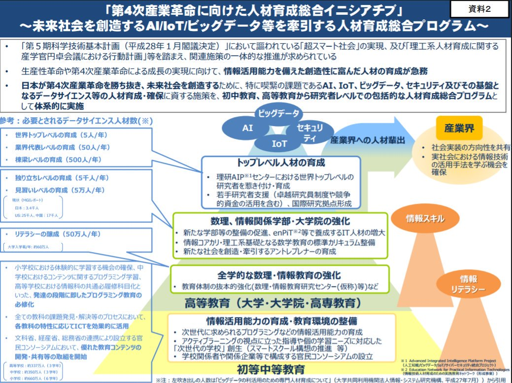

slidenumbers: true
footer: © Masayuki Higashino, 2016

## FOSS4G 2016 Tokyo
# FOSS4Gによる誰でも作れる古地図アプリ基盤「考古地図（cocomaps）」の開発
## **東野正幸**、浅井秀子、山田憲昭、澤田廉路
## 鳥取大学
2016-11-05@東京大学駒場リサーチキャンパスAn棟

---
# 自己紹介: SNS

# Twitter: **@61503891**
# Facebook: **msyk.hgsn**

## 🌟Ruby, Ruby on Rails, Java, Node.js, Prolog🌟

---
# 自己紹介: おしごと（鳥取大学 総合メディア基盤センター）
✅ 本学の**情報ネットワーク**及び**情報システム**の運用
✅ [科研] **分散環境**における**モバイルエージェント**の動的デバッグ手法に関する研究 **(代表)**
✅ [厚生労働科研] **強度行動障害**のある人の支援を目的とした行動測定支援アプリケーションと情報共有支援システムの検討 **(分担)**
✅ [科研] 疑似SNSを利用した実践的**情報モラル教育法**の開発と評価に関する研究 **(分担)**

---
## 市民参加型地域課題解決コミュニティ
# 「**Code for Tottori**」

# [http://code4tottori.org/](http://code4tottori.org/)
もやってます。

---
# 本日のアウトライン

1. 文化的景観とその保護制度
2. 文化的景観を学ぶための「古地図アプリ」
3. オープンソース文化とシビックテック
4. これからの地域情報化

---
# 文化的景観 #とは

> 地域における人々の生活又は生業及び当該地域の風土により形成された景観地で我が国民の生活又は生業の理解のため欠くことのできないもの
-- 文化財保護法第二条第1項第五号より

---
# 文化的景観の概要

* 2004年の文化財保護法の改正により導入された**新しい文化財**の一類型
* 文化庁のウェブページ「文化的景観」 [http://www.bunka.go.jp/seisaku/bunkazai/shokai/keikan/](http://www.bunka.go.jp/seisaku/bunkazai/shokai/keikan/)

文化庁のパンフレット[『魅力ある風景を未来へ ―文化的景観の保護制度―』](http://www.bunka.go.jp/tokei_hakusho_shuppan/shuppanbutsu/bunkazai_pamphlet/pdf/pamphlet_ja_02_ver2.pdf)によると（次ページ ▶︎）

---

---

---
# **重要**文化的景観の選定制度

地域における人々の営みが形成した景観について

* 市町村が自ら文化的景観としての**価値を提示**
* **保存計画**や**保護条例**の**策定**などを自ら整備
* 市町村が自ら**国に申請**

する必要がある。

**▶︎ 🔥地域が自ら主体的に取り組む必要がある。**

^ 重要文化的景観に選定された景観は2015年10月7日現在で50件

---
## 文化的景観に関する取り組みを実現するには

文化的景観は人々の営みと共に在る、言わば**生きた文化財**であり、文化的景観に関する**地理・歴史資料**などを用いた地域における**継続的な学び**が重要となる。

**▶︎ 🔥人々の営みを表す地図の作成を継続してゆく必要がある。**
**▶︎ 🔥古地図の保存や地域の人々しか知らない情報の集積が重要になる。**

^ 時系列地理情報の必要性

---
# 必要な要素

1. 地域が自ら主体的に取り組む必要がある。
2. 人々の営みを表現する地図の作成を継続してゆく必要がある。
3. 地域事情は地域の人々しか（あまり）知らない。

**▶︎ 🔥アプリを買ってきて使うだけでは続かない。**
**▶︎ 🔥自分たちで作れるようにしたい。**

---
# 最近のトレンド

* **オープンデータ**: 情報技術が一般へ浸透
* **シビックテック**: エンジニアが技術を使って地域活動を開始
* **Code for X**: 技術による地域活動を組織・ブランディングする仕組みが確立
* **ハッカソン**: 地域情報化に**能動的な動き**の変化

---

初等教育から研究者レベルでの包括的な人材育成総合プログラム（産業競争力会議 文部科学省）
▶︎ 🔥ICTを**使う**ことから**作る**ことへ

---
# 古地図アプリを**みんなで作れるように**しよう。

---
# 国内の動向（黎明期）

* **1989年**: まちづくりへの参加の新しい局面とその道具としての「ガリバー地図」 / 中村昌広 / **✏️巨大な地図にみんなで書き込んで遊ぶ。住民のまちづくり参加促進**
* **1991年**: 地図遊びとまち歩きを通したまち環境学習に関する研究「おもしろ地図ビッグマップ」と「おもしろ探偵団」の実践を通して / 八尾哲史ら / **✏️「地図遊び」と「まち歩き」の考察**

---
# 国内の動向（情報化）
* **2003年**: 「インターネット書き込み地図方情報交流システム 「カキコまっぷ」の課題と展開可能性」 / 真鍋陸太郎・小泉秀樹・大方潤一郎 / **✏️WebGISを使ったコミュニケーション**
* **2005年**: 時系列地形図閲覧ソフト『今昔マップ』(首都圏編）の開発 / 谷謙二 / **✏️WebGISを使った古地図と今地図の比較**

---
# 国内の動向（合意形成）
* **2001年**: 地域資源に対する住民の価値評価構造に関する研究: 福島県原町市での分析 / 秋田典子、佐土原聡 **✏️市民、市民グループ、専門家によって評価基準が違うこと提示**
* **2008年**: 地域計画と住民の意識構造に関する研究 / 古澤慎一 / **✏️異なる価値観を持った住民の合意形成を検討**

^ 古地図問題

---
# 昔からあるアプリの調査

* **2003年〜**: [カキコまっぷ](https://www.j-lis.go.jp/lasdec-archive/rdd/community-tool/kenkyukai/kenkyukai_5/manabe.pdf): ウェブの地図にみんなで書き込むシステム
* **2003年〜**: [今昔マップ](http://ktgis.net/kjmapw/): 今の地図と古い地図を見比べる地図

---
# 最近のアプリの調査
* [42 MATTERS App Market Data API](https://42matters.com/)で「古地図」を検索

---
# 古地図アプリを**みんなで作れるようには**まだなっていない。

---
# 地域にコミュニティベースの情報化をもたらした5374.jpの前例

**[5374.jp](https://github.com/codeforkanazawa-org/5374)**: オープンデータを使ったゴミ収集日の確認アプリ。簡単に自分たちの地域のアプリを作れる。

1. GitHubでフォーク（470フォーク）
2. CSVを編集
3. GitHubページで利用可能

▶︎ 🔥コーディングがほぼ不要！

---
# （古地図の著作権）市町村との連携に向けて

* 古地図のオープンデータ化は難しい。
* 大事に守ってきた地域のコンテンツでもある。

▶︎ 🔥古地図のデータをGitHubに置きづらい。（置いた時点でクローンを許可することになる。）

---
# （教育への組み込み）小学校での利用準備に向けて

* わりと古いタブレット: WebGL等は重たくて動かない。
* WiFiモデル: インターネット接続を前提にはできない。

▶︎ 🔥ローカルで動作するアプリにする必要がある。

---
# アプリ化の展望

1. 古地図をジオリファレンスしてGCPリスト作成
2. 古地図とGCPリストから地図タイルを作成
3. 位置情報のマーカーとコンテンツの配置
4. Apache CordovaでiOSまたはAndroidアプリ化

▶︎ 🔥無駄なコーディングを不要にするには、**ほとんどの処理でサーバが必要**

---
# クラウドへの容易なデプロイ手段の普及

* Heroku
* Azure
* OpenShift
* Bluemix

事例: [slackin](https://github.com/rauchg/slackin)

---
# これからのオープンな情報システムに必要な文化

* オープンデータ: ある。
* オープンソース: ある。
* オープンサービス: 計画時にここまで意識しておく必要がある。

---
# 考古地図（cocomaps）
# 仲間募集中です！

[https://github.com/mh61503891/cocomaps](https://github.com/mh61503891/cocomaps)

